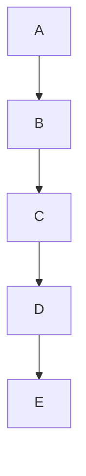
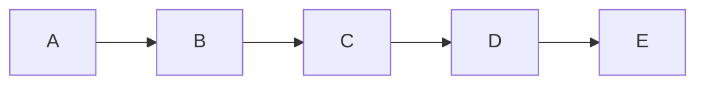
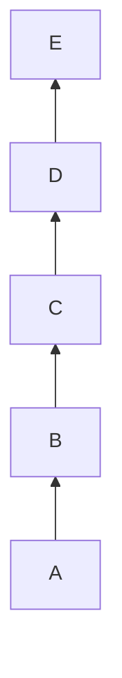
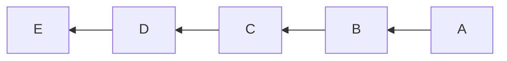

# Table of Contents

` markdown-cheatsheet` is a single place for all the markdown syntaxes I have learned so far. Sharing publicly so that you also know about them and use.

1. [Headings](#headings)
2. [Code](#code)
3. [Code Block](#code-block)
4. [Unordered List of Items](#unordered-list-of-items)
5. [Ordered List of Items](#ordered-list-of-items)
6. [CheckBox Task List](#checkbox-task-list)
7. [Strikethrough Text](#strikethrough-text)
8. [Blockquote Text](#blockquote-text)
9. [Bold](#bold)
10. [Italic](#italic)
11. [Bold and Italic](#bold-and-italic)
12. [Link](#link)
13. [Image](#image)
14. [Linking an Image](#linking-an-image)
15. [Emojis](#emojis)
16. [Table](#table)
17. [Table With Alignments](#table-with-alignments)
18. [Horizontal Line](#horizontal-line)
19. [HTML](#html)
20. [Embed YouTube Video](#embed-youtube-video)
21. [Mathematical Expressions](#mathematical-expressions)
22. [DropDown](#dropdown)
23. [Diagrams](#diagrams)
24. [FootNote](#footnote)
25. [Comments](#comments)

Many Thanks to all the `Stargazers` who has supported this project with stars(⭐)

[](https://github.com/atapas/markdown-cheatsheet/stargazers)

## Headings

**Syntax:**

```
# H1 - Heading 1
## H2 - Heading 2
### H3 - Heading 3
#### H4 - Heading 4
##### H5 - Heading 5
###### H6 - Heading 6
```

**Output:**

# H1 - Heading 1

## H2 - Heading 2

### H3 - Heading 3

#### H4 - Heading 4

##### H5 - Heading 5

###### H6 - Heading 6

## Code

**Syntax:**

```
`This is Code`
```

**Output:**

`This is Code`

## Code Block

**Syntax:**

````
```
This is a code block. You can create for code syntaxes like JavaScript, HTML, CSS, Bash, and many more.
```
````

**Output:**

```
This is a code block. You can create for code syntaxes like JavaScript, HTML, CSS, Bash, and many more.
```

In order to **_highlight the code_**, you can add language name at the start of the backticks as in the following examples.

**Example 1:**

````
```js
function print() {
 console.log('This is is a JavaScript Code Block');
}
```
````

**Output:**

```js
function print() {
	console.log("This is is a JavaScript Code Block");
}
```

**Example 2:**

````
```bash
# This is bash
echo 1
```
````

**Output:**

```bash
# This is bash
echo 1
```

## Unordered List of Items

**Syntax:**

```
- Milk
- Tea
- Beer
```

**Output:**

- Milk
- Tea
- Beer

**Syntax:**

> This is an alternate syntax to create unordered list items.

```
* JavaScript
* TypeScript
* ReactJs
```

**Output:**

- JavaScript
- TypeScript
- ReactJs

## Ordered List of Items

**Syntax:**

```
1. Eat
1. Walk
1. Sleep
```

**Output:**

1. Eat
1. Walk
1. Sleep

## CheckBox Task List

**Syntax:**

```
- [X] Code
- [ ] Review
- [ ] Commit
```

**Output:**

- [x] Code
- [ ] Review
- [ ] Commit

## Strikethrough Text

**Syntax:**

```
~~Sharing is NOT about Caring.~~
```

**Output:**

~~Sharing is NOT about Caring.~~

## Blockquote Text

**Syntax:**

```
> When I say something, I mean it. When I mean it, I do it. When I do, I may fail. When I fail, I start talking about it again!
```

**Output:**

> When I say something, I mean it. When I mean it, I do it. When I do, I may fail. When I fail, I start talking about it again!

## Bold

**Syntax:**

```
**DO NOT UNDERESTIMATE THE POWER OF A PROGRAMMER.**
```

**Output:**

**DO NOT UNDERESTIMATE THE POWER OF A PROGRAMMER.**

## Italic

**Syntax:**

```
*It is Written in Italics*
```

**Output:**

_It is Written in Italics_

## Bold and Italic

**Syntax:**

```
**_You Can Combine Bold and Italics_**
```

**Output:**

**_You Can Combine Bold and Italics_**

## Link

**Syntax:**

```
Did you know I have [Website](https://tapasadhikary.com)?
```

**Output:**

Did you know I have [Website](https://tapasadhikary.com)?

## Image

**Syntax:**

```

```

**Output:**


## Linking an Image

**Syntax:**

```
[](hyperlink)
```

**Output:**

[](https://blog.greenroots.info)

## Image Based on Theme

**Syntax:**

```

```

or

```

```

**Output (try changing themes!):**


## Emojis

**Syntax:**

```
:mango: :lemon: :man: :car:
```

**Output:**

:mango: :lemon: :man: :car:

## Table

**Syntax:**

```
| Fruit | Emoji |
| ----------- | ----------- |
| Mango | :mango: |
| Lemon | :lemon: |
```

**Output:**

| Fruit | Emoji   |
| ----- | ------- |
| Mango | :mango: |
| Lemon | :lemon: |

## Table With Alignments

**Syntax:**

```
| Fruit(left)      | Emoji(center) | Taste(right)     |
| :---        |    :----:   |          ---: |
| Mango is the king of Fruits      | :mango:       | Sweet and I love it  |
| Lemon is good for health   | :lemon:        | Sour, mix it in the water     |
```

**Output:**

| Fruit(left)                 | Emoji(center) |              Taste(right) |
| :-------------------------- | :-----------: | ------------------------: |
| Mango is the king of Fruits |    :mango:    |       Sweet and I love it |
| Lemon is good for health    |    :lemon:    | Sour, mix it in the water |

## Horizontal Line

**Syntax:**

```
---
```

**Output:**

---

## HTML

**Syntax:**

```
<p align="center">
 Yes, you can use allowed raw HTML in mark-down file.
 This is a paragraph aligned in the center.
</p>
```

**Output:**

<p align="center">
 Yes, you can use allowed raw HTML in mark-down file.
 This is a paragraph aligned in the center.
</p>

<details>
    <summary>Heading</summary>
    The details are here.
</details>

## Embed YouTube Video

**Syntax:**

```
[](YOUTUBE VIDEO LINK)
```

**Output:**

[](https://www.youtube.com/watch?v=OulZeVtZhZQ)

## Mathematical Expressions

1. **Inline expressions:**

   **Syntax**

   ```plain
   $<<mathematical expression>>$
   ```

   Replace `<<mathematical expression>>` with your expression.

   **Example**

   ```plain
   $\sqrt{3}+1$
   ```

   **Output**

   $\sqrt{3}+1$

2. **Block Expressions:**

   **Syntax**

   ```plain
   $$<<mathematical expression>>$$
   ```

   **Example**

   ```plain
   $$\sqrt{3}+1$$
   ```

   **Output**

   $$\sqrt{3}+1$$

3. **Mixed Expressions:**

   **Syntax**

   ```
   When $a \ne 0$, there are two solutions to $(ax^2 + bx + c = 0)$ and they are

   $$ x = {-b \pm \sqrt{b^2-4ac} \over 2a} $$
   ```

   **Output**

   When $a \ne 0$, there are two solutions to $(ax^2 + bx + c = 0)$ and they are

   $$ x = {-b \pm \sqrt{b^2-4ac} \over 2a} $$

For more information on how to write mathematical expressions, [visit this page](https://en.wikibooks.org/wiki/LaTeX/Mathematics).

## DropDown

1. DropDown with Open:
   <br>**Syntax**

```
<details open>
<summary>Want to know more? </summary>
<br>
This is called a DropDown.
<br>Yes! This is possible using Markdown.
<br>You can hide some content from the user.
<br>They can view the detailed message only when they click.
</details>
```

**Output**

 <details open>
 <summary>Want to know more?</summary>
 <br>
 This is called a DropDown.
 <br>Yes! This is possible using Markdown.
 <br>You can hide some content from the user.
 <br>They can view the detailed message only when they click.
 </details>

**Explanation**
<br>The _details_ tags are used to indicate that we want a dropdown.
<br>The keyword _open_ in details tag is causing the dropdown to stay opened even before the user clicks on it, which messes up the fun!
<br>It looks like a question and answer - this is not our purpose, we fix this in the below example.
<br>Between the _summary_ tags, we write the heading/content to be displayed.
<br>After _summary_, we can include the detailed content.
<br>However, when a user clicks on the arrow, the detailed content gets hidden; with another the click, the content is displayed again.

2. DropDown without Open:
   <br>**Syntax**

```
<details>
<summary>Want to know more? Click Here</summary>
<br>
This is called a DropDown.
<br>Yes! This is possible using Markdown.
<br>You can hide some content from the user.
<br>They can view the detailed message only when they click.
</details>
```

**Output**

 <details>
 <summary>Want to know more? Click Here</summary>
 <br>
 This is called a DropDown.
 <br>Yes! This is possible using Markdown.
 <br>You can hide some content from the user.
 <br>They can view the detailed message only when they click.
 </details>

**Explanation**
<br>The _details_ tags are used to indicate that we want a dropdown.
<br>This is what we require, the detailed content should be hidden initially. With a click, the information should be displayed.
<br>Between the _summary_ tags, we write the heading/content to be displayed inside or what we refer to as **DROPDOWN TITLE**.
<br>After _summary_, we can include the detailed content, this will be shown only when the user clicks the dropdown title.

## Diagrams

**Syntax:**

- Use the _mermaid_ syntax
- Additional syntax: TD means Top Down, LR means Left Right, BT means Bottom Top, RL means Right Left

TD variant

````
    ```mermaid
        graph TD;
            A-->B;
            B-->C;
            C-->D;
            D-->E;
    ```
````

**Output:**



LR variant

````
    ```mermaid
        graph LR;
            A-->B;
            B-->C;
            C-->D;
            D-->E;
    ```
````

**Output:**



BT variant

````
    ```mermaid
        graph BT;
            A-->B;
            B-->C;
            C-->D;
            D-->E;
    ```
````

**Output:**



RL variant

````
    ```mermaid
        graph RL;
            A-->B;
            B-->C;
            C-->D;
            D-->E;
    ```
````

**Output:**



## FootNote

**Explanation:**
<br>Footnotes allow you to add notes and references without cluttering the body of the document.
<br>When you create a footnote, a superscript number with a link appears where you added the footnote reference.
<br>Readers can click the link to jump to the content of the footnote at the bottom of the page.

**Syntax:**

```
Here's a simple footnote,[^1] and here's a longer one.[^bignote]

[^1]: This is the first footnote.

[^bignote]: Here's one with multiple paragraphs and code.

```

**Output:**

Here's a simple footnote,[^1] and here's a longer one.[^bignote]

[^1]: This is the first footnote.
[^bignote]: Here's one with multiple paragraphs and code.

## Comments

**Explanation:**
<br>Comments are text notes added to a program or a document to provide explanatory information.
<br>You can hide content from the rendered Markdown by placing the content in a comment.

**Syntax**

```
This is Line Number 1.
<!---This is Line Number 2 and would not be rendered as this is a comment. --->
This is Line Number 3.
```

**Output**

This is Line Number 1.

<!---This is Line Number 2 and would not be rendered as this is a comment. --->

This is Line Number 3.
